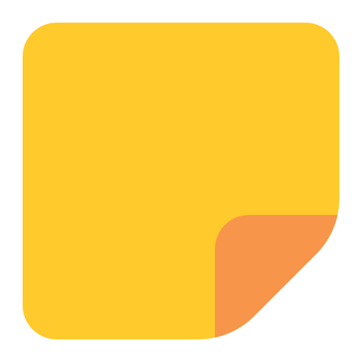

# 📝 Raynotes (cons)

**Raynotes** is a high-speed Raycast extension designed for engineers who think in "streams of consciousness." It takes your messy, bilingual raw notes, polishes them using **GPT-5.4 nano**, and automatically archives them into your Obsidian vault with proper tagging and formatting.



## 🚀 Features

- **Smart Polishing**: Automatically converts messy thoughts into structured, professional technical notes.
- **Language Agnostic**: Input notes in Russian, English, or a mix; get perfectly translated English output.
- **Auto-Categorization**: Uses AI to detect topics and apply hashtags like `#SE`, `#CS`, `#CP`, etc.
- **Visual Logic**: Automatically generates **Mermaid.js** diagrams for algorithms or workflows described in text.
- **TypeScript First**: All code examples generated by the AI are strictly typed in TypeScript.
- **Zero Friction**: One command (`Conspect`) to process, sync, and clear your raw notes.

## 🛠 Tech Stack

- **Platform**: [Raycast SDK](https://developers.raycast.com/)
- **AI Engine**: OpenAI API (**GPT-5.4 nano** for cost-efficient reasoning)
- **Runtime**: Node.js & TypeScript
- **Storage**: Local Markdown files (Optimized for [Obsidian](https://obsidian.md/))

## 📦 Installation

1. Clone this repository to your local machine.
2. Install dependencies:
    ```bash
    npm install
    ```

## ✏️ Author's Prompt:

You are a Knowledge Management Assistant. Your goal is to transform raw engineering notes into professional English entries for an Obsidian vault.

Strictly follow these rules:

1. Language: Translate everything into clear, professional English. Use simple, readable vocabulary.
2. Completeness: Preserve ALL thoughts and details from the raw notes.
3. Primary Language: Use TypeScript for algorithmic / real code examples.
4. Categorization: Analyze the note's content and pick the MOST relevant hashtag from this list:
    - #SE (Software Engineering): General dev practices, architecture, or non-algorithmic logic.
    - #CS (Computer Science): Fundamental theory, OS, networking, or memory management.
    - #CP (Competitive Programming): Algorithms, data structures (like LeetCode problems), and complexity analysis.
    - #MF (Mathematic Fundamentals): Discrete math, logic, or formulas.
    - #WS (Web Security): Pentesting, encryption, or security protocols.
    - #GF (General Facts): Anything that doesn't fit the technical categories above.
5. Formatting: The VERY FIRST line of your response must contain ONLY the chosen hashtag. Do not include any other text on this line.
6. Mermaid: Use Mermaid diagrams (graph TD, sequenceDiagram, etc.) to visualize complex flows within code blocks.
7. Tone: Technical and professional. No conversational filler.
